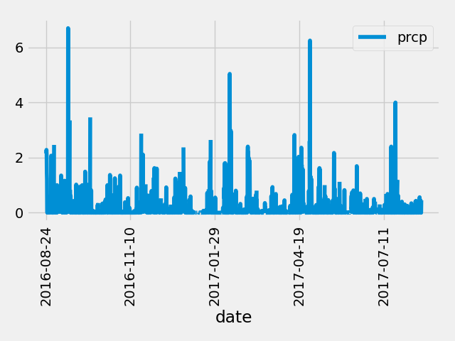
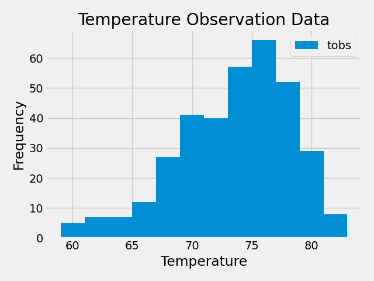

# Surfer Weather Analysis and Flask API

## Part 1: Analyze and Explore Climate Data

In this portion Python and SQLAlchemy are used to perform a basic climate analysis of the climate database. We use pandas and matplotlib for plotting and retrieve the data from the sqlite database using the SQLAlchemy Object Relational Mapper.

### Precipitation Analysis

We first determine the most recent date in the dataset using the query. Using that date, we can retrieve the previous twelve months of precipitation data. We then load the results of our query into a pandas DataFrame and plot the image.

```python
# Calculate the date one year from the last date in data set.
one_year_previous = datetime.datetime.strptime(recent_date, '%Y-%m-%d') - datetime.timedelta(days=365)

# Perform a query to retrieve the data and precipitation scores
last_twelve_months_precipitation = session.query(measurement_table.date, measurement_table.prcp).where(measurement_table.date >= one_year_previous).all()

# Save the query results as a Pandas DataFrame. Explicitly set the column names
prcp_df = pd.DataFrame(last_twelve_months_precipitation)

# Sort the dataframe by date
prcp_df = prcp_df.sort_values('date')

```



### Station Analysis

We now want to find the most active station. To do so, we need to use the count function along with a group by statement to determine the number of rows each station occurs in. We then sort the stations in descending order by count and find the first entry. After determining the station id for the most active station, we query the previous twelve months of temperature observation data and plot the results using a histogram.

```python 
# Determine the most active stations
most_active_stations_query = session.query(measurement_table.station, func.count(measurement_table.station)).group_by(measurement_table.station).order_by(func.count(measurement_table.station).desc())

# Retrieve the ID of the most active station
most_active_station_id = most_active_stations[0][0]

# Find all the entries from the most active station in the previous year
tobs_data_query = session.query(measurement_table.tobs).filter(measurement_table.station == most_active_station_id).filter(measurement_table.date >= one_year_previous)

# Use a list comprehension to retrieve the temperatures
tobs_data = [result[0] for result in tobs_data_query.all()]

# Plot the occurrence results 
plt.hist(tobs_data, bins=12, label='tobs')
```



## Climate Flask API

We have now performed the initial analysis overview and we want to use the queries we have developed to create an API that returns the requested information in JSON format.

We have the following API endpoints:

- `/`
    - Start at the homepage and list all the available routes.
- `/api/v1.0/precipitation`
    - Query results from the prior precipitation analysis are used (prior twelve months of data) and stored in a dictionary with the `date` as the key and the `prcp` as the value.
    - The JSON representation is then returned.
- `/api/v1.0/stations`
    - All stations are returned as a JSON list.
- `/api/v1.0/tobs`
    - The dates and temperature observations are queried for the most active station for the previous year.
    - The JSON list of temperature observations is returned.
- `/api/v1.0/<start> and /api/v1.0/<start>/<end>`
    - For both of these endpoints a JSON list of the temperature summary is returned for the given range. The primary differentiating factor is the way data is queried.
